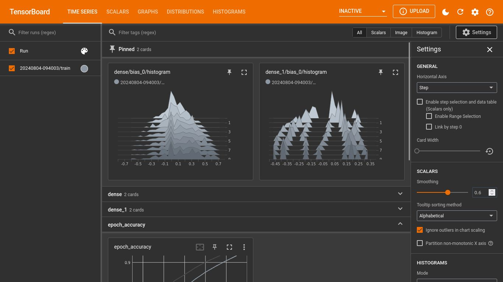
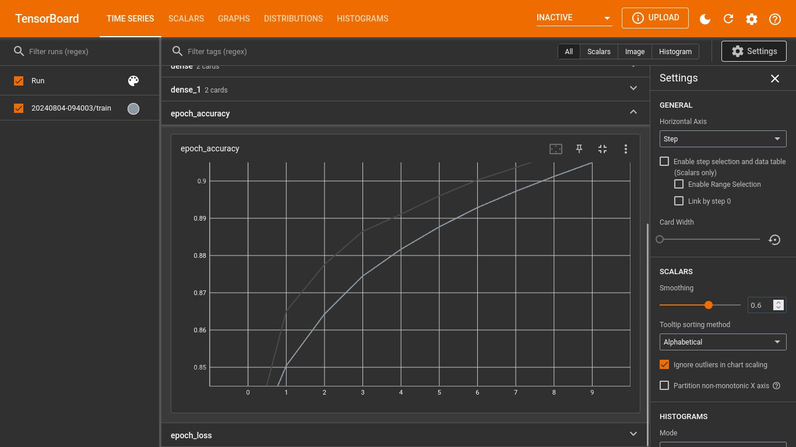
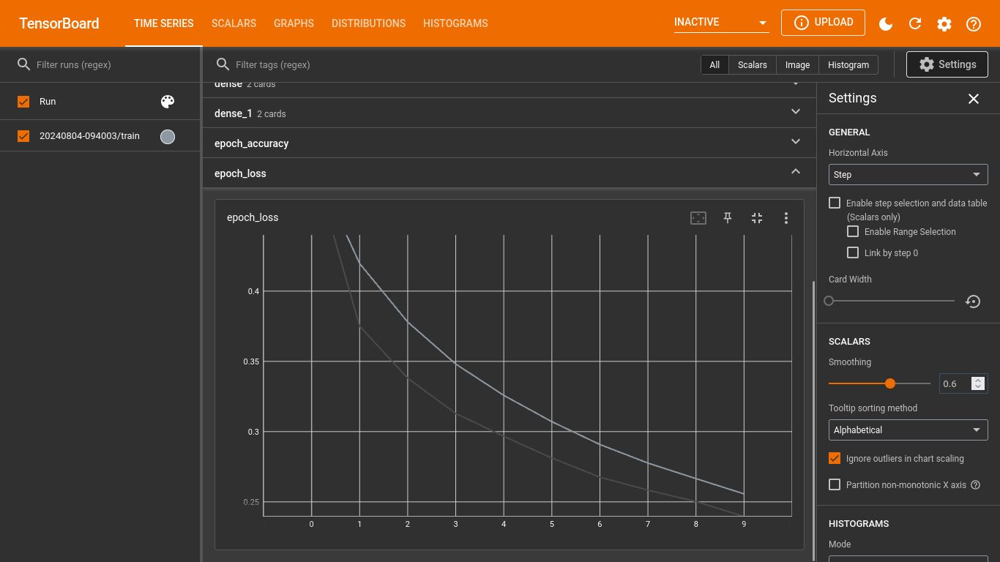

## About The APP

Machine learning-kepintaran buatan dasar yang mengklasifikasi pakaian dengan framework Tensorflow dan API Keras,  mengidentifikasi input gambar pakaian yang diklasifikasikan dalam 10 kategori (Kaos/atasan, Celana panjang,Sweater,Gaun,Mantel,Sandal,Kemeja,Sepatu kets,Tas,Sepatu bot). Dilatih menggunakan Fashion-Mnist dataset yang berisikan 60,000 gambar abu-abu berskala 28x28 pixels, terdiri dari 128 neuron dan dilatih dalam 10 epoch.

## How to Install

-   clone reponya, cth: git clone https://github.com/Apta-tea/ml-klasifikasi-pakaian.git
-   requirement Python 3.11.^
-   import library yang dibutuhkan cth: pip install tensorlow
-   eksekusi di terminal cth: python FashionClassification.py
-   aya mereun? [&#9749;](https://teer.id/enpisi7)
-   ada bug?, infokan  di repo issues

## License

[Creative Commons Attribution 4.0 cc-by-4.0](https://creativecommons.org/licenses/by/4.0/)
